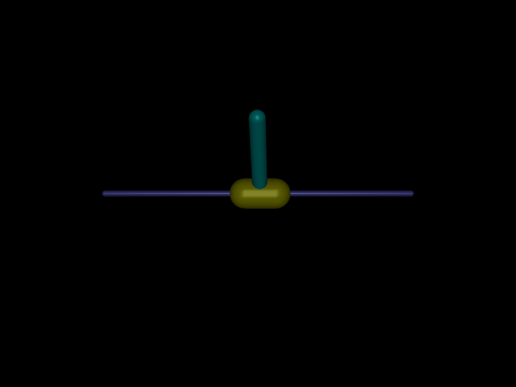
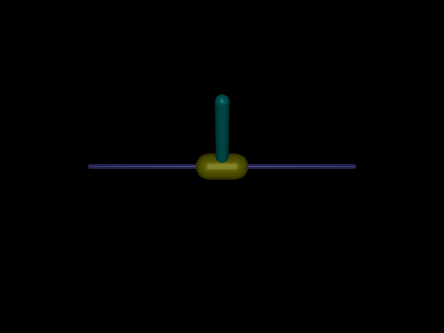
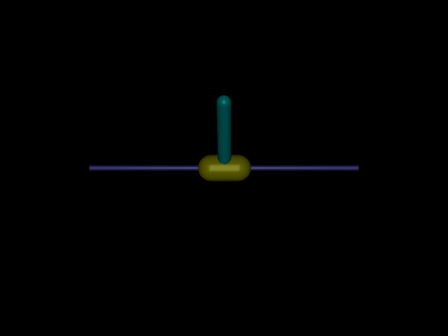

# cartpole
> Can we balance the pole by applying forces to the cart

## Getting Started
1. **Clone the repository**
```bash
git clone https://github.com/aditya-shriwastava/cartpole.git
cd cartpole
```

2. **Create and activate a virtual environment**
```bash
python3 -m venv .venv
source .venv/bin/activate
```

3. **Install dependencies**
```bash
pip install .
```

4. **Usage**
After installation, you can run cartpole with:
```bash
cartpole --help
```

4. **Training RL agents**
```bash
train-dqn --help # Similarly for PPO & SAC
```

## MDP problem formulation
1. Action Space:
    * Continuous in range [-3,3]
    * Represents force/100 (i.e. 100 is the gear ratio) applied to the cart.
2. Observation Space:
    * Position of the cart in range [-1, 1]. Represemnts distance from center in meters.
    * Angular position of the pole in range [-pi/2, pi/2]. Represents angle wrt upright position in radians.
    * Linear speed of the cart in range [-inf, inf]. Represents speed of cart in m/s.
    * Angular speed of the pole in range [-inf, inf]. Represents angular speed of cart in rad/s.
3. Reward
    * The goal is to keep the inverted pendulum stand upright for as long as possible.
    * The pole is considered upright if |angle| < 0.2 rad.
    * A reward of +1 is given for each timestep that the pole is upright.
4. Starting State:
    * Cart position: 0.0
    * Pole angel: 0.0
    * Cart velocity: 0.0
    * Pole angular velocity: 0.0
5. World model: Assume not known in all the cases except MPC

## Controls to implement
* [x] PID (Simplest Control, Just works in many cases)
* [x] MPC (Receding horizon optimal control, Go to classical control approach for most robotics problems)
* [x] DQN (Simple, Sample Efficient, First approach to show good results on atari games)
* [ ] PPO (Go to approach for most of the robotics control problem in simulator, Wall clock time efficient)
* [ ] SAC (Sample Efficient)

## Results

### PID
<div align="center">
  
  <br>
  <em><strong>Reward Achieved: 272</strong></em>
</div>

### MPC
<div align="center">
  
  <br>
  <em><strong>Reward Achieved: inf</strong></em>
</div>

### DQN
<div align="center">
  
  <br>
  <em><strong>Reward Achieved: inf</strong></em>
</div>

### PPO
<div align="center">
  
  <br>
  <em><strong>Reward Achieved: inf</strong></em>
</div>

### SAC
<div align="center">
  
  <br>
  <em><strong>Reward Achieved: inf</strong></em>
</div>
